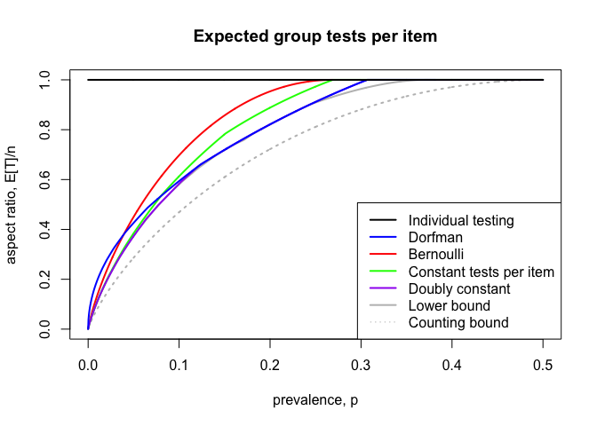
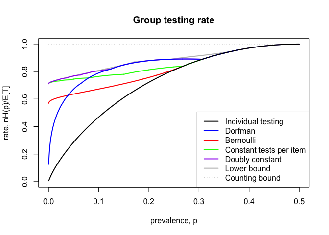
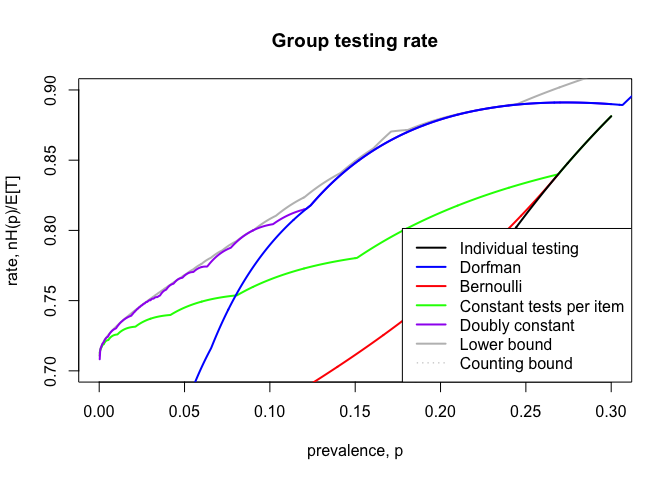

Conservative two-stage group testing
================
Matthew Aldridge
13/04/2020

Functions
---------

The bound based in the FKG inequality:

``` r
FKG <- function(p, w) {
  q <- 1 - p
  -w * log(1 - q^(w-1))
}

FKG2 <- function(p, w) {
  q <- 1 - p
  -w * log(1 - q^(w))
}

MyBound <- function(p) {
  wmax <- round(max(c(log(2)/p + 10, 10)))
  w <- (max(c(wmax-20), 2)):wmax
  MyFunc1 <- max(FKG(p, w))
  MyBd1 <- p + (1 / MyFunc1) * (log((1 - p) * MyFunc1) + 1)
  MyFunc2 <- max(FKG2(p, w))
  MyBd2 <- (1 / MyFunc2) * (log(MyFunc2) + 1)
  max(c(MyBd1, MyBd2))
}

MyBoundv <- function(pvec) {
  sapply(pvec, MyBound)
}

MyRatev <- function(pvec) {
  x <- sapply(pvec, MyBound)
  Entropy(pvec) / x
}
```

Binary entropy:

``` r
Entropy <- function(p) {
  p * log2(1 / p) + (1 - p) * log2(1 / (1 - p))
}
```

Algorithms
----------

Dorfman:

``` r
N <- 1000

ADorfAR <- function(p) {
  choices <- 1 / (2:N) + 1 - (1 - p)^(2:N)
  best <- min(c(1, choices))
}

ADorfARv <- function(pvec) {
  sapply(pvec, ADorfAR)
}


ADorfRate <- function(p) {
  Entropy(p)/ADorfARv(p)
}
```

Constant tests-per-item and items-per-test, following the work of Broder & Kumar of Google:

``` r
AGoogAR <- function(p) {
  q <- 1 - p
  guess <- round(log(2)/(p+0.0001)) + 40
  if (guess < 100) range <- 1:200
  else range <- (guess - 80):(guess+200)
  choices <- rep(0, length(range)) 
  rbig <- round(log(2)*Entropy(p+0.0001)/(0.75*(p+0.0001)))
  choices <- rep(0, rbig)
  for(r in 1:rbig) choices[r] <- min(r / (range) + p + q*(1 - q^((range)-1))^r)
  best <- min(choices)
  best <- min(c(1, best))
}

AGoogARv <- function(pvec) {
  sapply(pvec, AGoogAR)
}


AGoogRate <- function(p) {
  Entropy(p)/AGoogARv(p)
}


kGoogAR <- function(p, s) {
  q <- 1 - p
  NN <- N
#  if(p < 0.01) NN <- 10*N
  choices <- s / (1:NN) + p + q*(1 - q^((1:NN)-1))^s
  best <- min(c(1, choices))
}

kGoogARv <- function(pvec, s) {
  sapply(pvec, kGoogAR, s = s)
}


kGoogRate <- function(p, s) {
  Entropy(p)/kGoogARv(p, s)
}
```

Constant tests-per-item only:

``` r
UsFunc <- function(s, rr, pp) rr / s + pp + (1-pp)*(1 - exp(-pp*s))^rr


AUsAR <- function(p) {
  q <- 1 - p
  choices <- numeric(N)
  for(r in 1:N) {
    choices[r] <- optim(log(2)*Entropy(p+0.001)/(0.75*(p+0.001)), UsFunc, rr = r, pp = p)$value
  }
  best <- min(choices)
  best <- min(c(1, best))
}

AUsARv <- function(pvec) {
  sapply(pvec, AUsAR)
}


AUsRate <- function(p) {
  Entropy(p)/AUsARv(p)
}
```

Bernoulli:

``` r
COMPAR <- function(p) {
  pmin(p * (1 + exp(1) * log((1 - p) / p)), 1)
}

COMPRate <- function(p) Entropy(p)/COMPAR(p)
```

Pictures
========

Let's draw some pictures!

``` r
curve(Entropy, n = 1001, from = 0, to = 0.5,
      col="grey", ylim = c(0,1), xlab = "prevalence, p", ylab = "aspect ratio, E[T]/n", lty = 3, lwd = 2)
curve(COMPAR, add = TRUE, n = 1001, from = 0, to = 1/(exp(1) + 1), col = "red", lwd = 2)
curve(MyBoundv, from = 0.0001, to = 0.382, add = TRUE, n = 1001, col = "grey", lwd = 2)
curve(x-x+1, from = 0.382, to = 0.5, add = TRUE, n = 1001, col = "grey", lwd = 2)
curve(AUsARv,  add = TRUE, n = 1001, col = "green", lwd = 2)
curve(AGoogARv,  add = TRUE, n = 1001, col = "purple", lwd = 2)
curve(ADorfARv,  add = TRUE, n = 1001, to = 0.382, col = "blue", lwd = 2)
curve(x-x+1, add = TRUE, n = 1001, col = "black", lwd = 2)
legend("bottomright",
       legend = c("Individual testing", "Dorfman", "Bernoulli", "Constant tests per item", "Doubly constant", "Lower bound", "Counting bound"),
       col = c("black", "blue", "red", "green", "purple", "grey", "grey"),
       lwd = c(2,2,2,2,2,2,1),
       lty = c(1,1,1,1,1,1,3))
title("Expected group tests per item")
```



``` r
curve(x-x+1, n = 1001, from = 0, to = 0.5,
      col="grey", ylim = c(0, 1), xlab = "prevalence, p", ylab = "rate, nH(p)/E[T]", lty = 3, lwd = 1)
curve(COMPRate, from = 0, to = 1/(exp(1) + 1), add = TRUE, n = 1001, col = "red", lwd = 2)
curve(MyRatev, add = TRUE, from = 0.0001, to = 0.382, n = 1001, col = "grey", lwd = 2)
curve(Entropy, from = 0.382, to = 0.5, add = TRUE, n = 1001, col = "grey", lwd = 2)
curve(AUsRate,  add = TRUE, n = 1001, col = "green", lwd = 2)
curve(AGoogRate,  add = TRUE, n = 1001, col = "purple", lwd = 2)
curve(ADorfRate,  add = TRUE, n = 1001, to = 0.382, col = "blue", lwd = 2)
curve(Entropy, add = TRUE, n = 1001, col = "black", lwd = 2)
legend("bottomright",
       legend = c("Individual testing", "Dorfman", "Bernoulli", "Constant tests per item", "Doubly constant", "Lower bound", "Counting bound"),
       col = c("black", "blue", "red", "green", "purple", "grey", "grey"),
       lwd = c(2,2,2,2,2,2,1),
       lty = c(1,1,1,1,1,1,3))
title("Group testing rate")
```



``` r
curve(x-x+1, n = 1001, from = 0, to = 0.3,
      col="grey", ylim = c(0.7, 0.9), xlab = "prevalence, p", ylab = "rate, nH(p)/E[T]", lty = 3, lwd = 1)
curve(COMPRate, from = 0, to = 1/(exp(1) + 1), add = TRUE, n = 1001, col = "red", lwd = 2)
curve(MyRatev, add = TRUE, from = 0.0001, to = 0.3, n = 1001, col = "grey", lwd = 2)
curve(Entropy, from = 0.382, to = 0.5, add = TRUE, n = 1001, col = "grey", lwd = 2)
curve(AUsRate,  add = TRUE, n = 1001, col = "green", lwd = 2)
curve(AGoogRate,  add = TRUE, n = 1001, col = "purple", lwd = 2)
curve(ADorfRate,  add = TRUE, n = 1001, to = 0.382, col = "blue", lwd = 2)
curve(Entropy, add = TRUE, n = 1001, col = "black", lwd = 2)
legend("bottomright",
       legend = c("Individual testing", "Dorfman", "Bernoulli", "Constant tests per item", "Doubly constant", "Lower bound", "Counting bound"),
       col = c("black", "blue", "red", "green", "purple", "grey", "grey"),
       lwd = c(2,2,2,2,2,2,1),
       lty = c(1,1,1,1,1,1,3))
title("Group testing rate")
```


